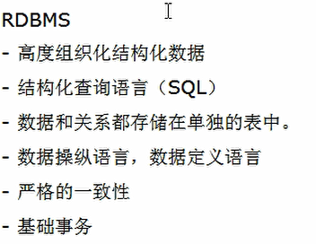

[TOC]


# 网站架构进化史

## 单机MySQL的美好时代


1.数据量的总大小一个机器放不下时
2.数据的索引（B+Tree）一个机器的内存放不下时
3.访问量（读写混合）一个实例不能承受

## Memcached（缓存）+MySQL+垂直拆分


在DAO（DAL）层和MySQL之间加了一个Cache（缓存）来减轻MySQL的压力

Redis就存放在这里

## MySQL主从读写分离


主从复制，在主库里进行什么操作就在从库里进行什么操作，实现容灾备份

读写分离，用户进行**写操作**放在**主库**里，进行**读操作**放在**从库**里

## 分表分库+水平拆分+mysql集群


即把彼此业务相关的操作放在一起，便是集群


## MySQL的扩展性瓶颈


## 今天是什么样子？


## 为什么使用NoSQL？


# NoSQL

## 是什么


## 能干嘛

### 易扩展


### 大数据量高性能


### 多样灵活的数据模型


### 传统DRBMS VS NOSQL




## 去哪下

+ Redis
+ Memcache：专注于高速缓存
+ Mongdb：最像关系型数据库的非关系型数据库

## 怎么玩

+ KV：键值对
+ Cache：
+ Persistence
+ ……


# 3V+3高

## 大数据时代的3V

+ 海量Volume
+ 多样Variety
+ 实时Velocity

## 互联网需求的3高

+ 高并发
+ 高可扩
+ 高性能


# 当下的NoSQL经典应用

+ 当下的应用是sql和nosql一起使用的
+ 阿里使用`UDSL(统一数据服务平台)`（相当于JDBC）来连接各种类型的数据库，避免了API过多混乱有了一个统一的管理平台


# NoSQL数据模型简介

+ 传统的关系型数据库：ER图
+ NoSQL：BSON
  + BSON：BSON是一种类json的一种二进制形式的存储格式，简称Binary JSON，它和JSON一样，支持内嵌的文档对象和数组对象

## 聚合模型

+ 聚合模型指的是NoSQL的数据模型（可以再去查阅资料了解）
+ 其包含：
  + KV键值对
  + Bson
  + 列族：顾名思义，是按列存储数据的。最大的特点是方便存储结构化和半结构化数据，方便做数据压缩，对针对某一列或者某几列的查询有非常大的IO优势。
  + 图形：类似于图论，最直观的例子就是QQ里面会推荐你和你的某个好友的共同好友给你，这不适合传统关系型数据库来构建

# NoSQL数据库的四大分类

+ KV键值对
+ 文档型数据库（bson格式比较多）
+ 列存储数据库
+ 图关系数据库


# 分布式数据库中CAP原理CAP+BASE

## 传统关系型数据库的ACID

+ A（Atomicity）原子性
+ C（Consistency）一致性
+ I（Isolation）独立性
+ D（Durability）持久性

## NoSQL数据库的CAP

+ C：Consistency（强一致性）
+ A：Availability（可用性）
+ P：Partition tolerance（分区容错性）

注意：**NoSQL只能从CAP中3选2！！！！**

## CAP的3进2


## BASE


## 分布式+集群


# Redis入门概述

## 是什么

+ Redis：**RE**mote **DI**ctionary **S**erver（远程字典服务器）（原来redis是三个英文首字母的缩写）


## Redis的优点

+ Redis支持数据的持久化，可以将内存中的数据保持在磁盘中，重启的时候可以再次加载进行使用
+ Redis不仅仅支持简单的key-value类型的数据，同时还提供list，set，zset，hash等数据结构的存储
+ Redis支持数据的备份，即master-slave模式的数据备份

## 能干嘛

+ 内存存储和持久化：redis支持异步将内存中的数据写到硬盘上，同时不影响继续服务
+ 取最新N个数据的操作，如：可以将最新的10条评论的ID放在Redis的List集合里面
+ 模拟类似于HttpSession这种需要设定过期时间的功能
+ 发布、订阅消息系统
+ 定时器、计数器

## 去哪下

+ https://redis.io/
+ http://www.redis.cn/

## Redis的安装

### window下

下载地址：https://github.com/microsoftarchive/redis/releases

直接下载绿色版.zip解压即可使用

可以参考https://www.cnblogs.com/W-Yentl/p/7831671.html


测试使用：


### Linux下

通过云服务器演示：

首先在redis官网下载好redis安装包，比如这次我用的是`redis-5.0.4.tar.gz`

将其上传至云服务器之后移动到`/opt`目录下解压


进入redis目录，使用`ll`命令查看文件结构：


我们主要使用上图中的`MakeFile`来编译整个redis程序，所以我们只需要在redis这个文件目录里面执行`make`或者`sudo make`即可，前提是你已经装好了gcc环境，这里不再赘述安装gcc步骤


最终编译完成截图：


此时你不需要执行`make test`命令，因为这样你还要安装其他包，只要看见这个界面就可以了！

最后在进入到`src`目录执行`make install`或者`sudo make install`确认是否安装成功：


这样redis就安装成功了！！！

## Redis的HelloWorld入门

安装完成之后来做一个redis的HelloWorld测试

**注**：我们尽量不要改动原来redis目录里的东西！！！

我们在`/opt`里面`sudo mkdir myRedis`新建一个属于我们的redis文件夹，并且将原来redis文件夹里面的`redis.conf`使用`sodu cp redis.conf /opt/myRedis`命令复制一份到`myRedis`文件夹之中去


接着用vim编辑`myRedis`里面的`redis.conf`，将下图的地方改为`yes`，使其可以作为守护进程后台运行：


保存退出后，再进入`/usr/local/bin`目录下：


使用`ps -ef|grep redis`命令查看后台redis服务这个进程有没有起来，当我没有启动redis时是这样的：


接下来我们**启动我们自己配置的redis.conf**：`redis-server /opt/myRedis/redis.conf`


接着使用`redis-cli -p 6379`来与刚刚启动的`redis-server`进行交互

+ **redis-cli**是Redis命令行接口，一个允许从终端向Redis服务器发送命令和从服务器读取响应的简单程序
+ 6379是redis-server默认端口

发送命令`ping`如果redis-server返回给你的是`PONG`则代表连接成功


测试HelloWorld：


此时再使用`ps -ef|grep redis`查看后台redis服务：


可以发现已经有了redis服务启动！

## Redis的关闭

+ 使用`exit`是关闭redis-cli与redis-server的连接，即关闭redis-cli，redis-server不会被关闭
+ 使用`SHUTDOWN`是关闭redis-server，但有时会出现关闭失败的情况，也可以使用`sudo kill -9 [redis-server PID]`来强制停止redis-server服务


## Redis启动后的杂项基础知识

+ redis是单进程：epoll，IO多路复用
+ redis默认有16个数据库，从`redis.conf`里面可以知道：


切换数据库命令：`select <dbid>`，其中`<dbid>`是从0到数据库数量减1的范围

+ Dbsize命令查看当前数据库的key的数量
+ 既然你查看了key的数量，你肯定想知道这些key具体是什么，那就使用`keys *`命令查看当前数据库的所有key
  + `keys k?`：查询以k开头后面接任意一个占位的所有key（模糊查询）
+ `FLUSHDB`：清除当前库里面所有键值对
  + `FLUSHALL`：删除所有库的所有键值对
+ redis统一密码管理，16个库都是同样的密码，要么都ok要么一个也连接不上、
+ redis索引都是从0开始的
+ redis默认端口6379


# Redis常用五大数据类型及常用命令

+ String（字符串）
  + string是redis最基本的类型，你可以理解成与Memcached一模一样的类型，一个key对应一个value
  + string类型是`二进制安全`的。意思是redis的string可以包含任何数据。比如jpg图片或者序列化的对象
  + string类型是Redis最基本的数据类型，一个redis中字符串value最多可以是512M
+ Hash（哈希）
  + Redis hash 是一个键值对集合
  + Redis hash是一个string类型的field和value的映射表，hash特别适合用于存储对象，类似于java里面的`Map<String,Object>`
+ List（列表）
  + Redis 列表是简单的字符串列表，按照插入顺序排序。你可以添加一个元素到列表的头部（左边）或者尾部（右边）
  + 它的底层实际是个链表
+ Set（集合）
  + Redis的Set是string类型的无序无重复集合。它是通过HashTable实现实现的
+ Zset（sorted set：有序集合）
  + Redis zset和set一样也是string类型元素的集合，且不允许重复的成员
  + 不同的是每个元素都会关联一个double类型的分数
  + redis正是通过分数来为集合中的成员进行从小到大的排序。zset的成员是唯一的，但分数（score）却可以重复

## 从哪里获得redis常用数据类型操作命令

+ http://redisdoc.com/
+ http://doc.redisfans.com/


## Redis 键（Key）

+ `del key` 在key存在时删除key
+ `dump key` 序列化给定key，并返回被序列化的值
+ `keys * ` 列出所有的key
+ `move key db`  将当前库指定key剪切到db库内，db为库的编号
+ `expire key 秒钟`  为给定的key设置过期时间
+ `ttl key`  ttl=time to live 查看还有多少秒钟过期；-1表示永不过期；-2表示已经过期
+  `type key` 查看指定key的类型


## Redis 字符串（String）

+ `set key value`  设置key的值
+ `get key`获取key的值
+ `del key` 删除key
+ `append key value`将value追加到key当前存储值的末尾
+ `strlen key`返回key对应value的长度
+ `incr key`加1
  + `incrby key 增量` 按照指定增量给key的value增加 

+ `decr key`减1
  + `decrby key 减量`同上
+ 注意：上面两个命令一定要是数字才能生效！！！
+ `getrange key start end`获取下标start到end的字符串
+ `setrange key offset value`从key对应的值的offset处开始将value值给key


+ `setex key 秒数 value`设置key对应value并存活相应的秒数
  + setex：set with expire
+ `setnx key value`如果key已经存在则失效，若key不存在则生效
  + setnx：set if not exist
+ `mset key1 value1 key2 value2 ……`一次给多个key赋值
+ `mget key1 key2 ……`一次查看多个key的值
+ `msetnx key1 value1 key2 value2 ……`同上，只有其设置的所有key都没存在时才会生效命令
+ `getset key value`将key对应的值设置为value，同时返回之前的key对应的value值


## Redis 列表（List）

+ `lpush key [value]`将一个或多个加入列表左端
+ `rpush key [value]`将一个或多个加入列表右端
+ `lrange key start end`返回从start 到end的元素 包含start和end
  + 常用`lrange key 0 -1` 返回key对应的所有元素
+ `lpop key`移除并返回列表最左端的元素
+ `rpop key`移除并返回最右端的元素
+ `lindex key offset`返回下标（偏移量）为offset的元素
+ `llen key`返回长度
+ `lrem key number value`删除key中number个value


+ `ltrim key start end` 只保留从start 到end的元素 包含start和end


+ `rpoplpush 源列表 目的列表` 从源列表右端剪切出一个元素放到目的列表的左端

+ `lset key index value `给key对应的列表的为index索引的值重新设为value
+ `linsert key before/after value1 value2`在value1前/后插入value2


## Redis 集合（Set）

+ `sadd key item……`添加多个，返回新添加的个数（已存在的不算）


+ `smembers key`返回set的所有元素
+ `sismember key item`检查元素item是否在集合中；0代表不在，1代表在
+ `scard key` 获取key对应集合的元素个数
+ `srem key item…`从集合移除多个元素 ，返回被移除元素的数量
+ `srandmember key cout` 随机返回cout个元素 cout为正整数 随机元素不重复


+ `spop key`随机的移除一个元素 并返回已删除的元素
+ `smove key1 key2 item` 如果key1中包含item 移除key1中的item 添加到key2中，成功返回1 失败返回0


### 数学集合类

+ 差集：`sdiff 集合1 集合2` 返回在第一个set里面而不在后面任何一个set里面的项


+ 交集：`sinter 集合1 集合2`


+ 并集：`sunion 集合1 集合2`


## Redis 哈希（Hash）

+ KV模式不变，但**V是一个键值对**
+ `hset/hget`一次赋单个值


`hset user username suki`相当于是key为`user`，其中value为`username:suki`

所以取值的时候是`hget user username`

+ `hmset/hmget`一次赋多个值more


+ `hgetall key`获取key对应的hash所有键值对


+ `hdel`


将key为user的name键值对删除

+ `hlen key`查看键值对个数
+ `hexists key value` 查看key对应的键值对的键是否含有value
+ `hkeys/hvals`
  + `hkeys key` 查看key对应的键值对的所有key
  + `kvals key`查看key对应的键值对的所有value

+ `hincrby/hincrbyfloat`增量增加
+ `hsetnx` 只有不存在该键才会设置值

## Redis 有序集合Zset（sorted set）

+ 在set基础上，加一个score值。之前set是k1=>(v1,v2,v3)，现在zset是k1=>(score1 v1,score2 v2,score3 v3)
+ `zadd`


+ `zrange`


+ `（ `代表不包含


+ `limit` 在结果中再截取


+ `zrem key value`删除元素
+ `zcard key`返回所有成员个数
+ `zcount key min max`返回分值在 min和max中间的排名
+ `zrank key member`返回成员member在集合中的排名
+ `zscore key member`返回member的分值
+ `zrevrank、zrevange、zrevrangebyscore`逆序的意思


# 解析配置文件redis.conf

+ linux下面开发：`配置大于编码`

+ linux一定一定要备份配置文件！！！

## Units单元


1配置大小单位，开头定义了一些基本的度量单位，只支持bytes，不支持bit
2对大小写不敏感

## INCLUDES包含


和我们的Struts2配置文件类似，可以通过includes包含，redis.conf可以作为总闸，包含其他

## GENERAL通用


下面提及一些比较关键的点：

### TCP-backlog


### TCP-keepalive


### redis日志级别


## SNAPSHOTTING（快照）

### save


如果想禁用RDB持久化的策略，只要不设置任何save指令，或者给save传入一个空字符串参数也可以

+ 要求现在立马备份，可以输入`save`或者`bgsave`命令立马备份
  + save:save时只管保存，其它不管，全部阻塞
  + bgsave:Redis会在后台异步进行快照操作，快照同时还可以响应客户端请求。可以通过lastsave命令获取最后一次成功执行快照的时间
+ 执行flushall命令，也会产生dump.rdb文件，但里面是空的，无意义


### stop-writes-on-bgsave-error


如果配置成no，表示你不在乎数据不一致或者有其他的手段发现和控制


### rdbcompression


rdbcompression：对于存储到磁盘中的快照，可以设置是否进行压缩存储。如果是的话，redis会采用LZF算法进行压缩。如果你不想消耗CPU来进行压缩的话，可以设置为关闭此功能

### rdbchecksum


rdbchecksum：在存储快照后，还可以让redis使用CRC64算法来进行数据校验，但是这样做会增加大约10%的性能消耗，如果希望获取到最大的性能提升，可以关闭此功能


## PERLICATION（复制）

## SECURITY（安全）


+ 可以给redis设置密码`config set requirepass 123456`


redis并不建议我们设密码


## LIMITS（限制）

### maxmemory-policy缓存清除策略


## APPEND ONLY MODE 追加


+ 可以同时启用AOF和RDB持久性而不会出现问题。如果在启动时启用AOF，Redis将加载AOF，即具有更好耐久性保证的文件

### appendfsync


### rewrite


## 常见配置Redis.conf介绍


# Redis持久化

## rdb

+ rdb=Redis DataBase

+ 在指定的时间间隔内将内存中的数据集快照写入磁盘，也就是行话讲的Snapshot快照，它恢复时是将快照文件直接读到内存里
+ Redis会单独创建（fork）一个子进程来进行持久化，会先将数据写入到一个临时文件中，待持久化过程都结束了，再用这个临时文件替换上次持久化好的文件。整个过程中，主进程是不进行任何IO操作的，这就确保了极高的性能。如果需要进行大规模数据的恢复，且对于数据恢复的完整性不是非常敏感，那RDB方式要比AOF方式更加的高效。RDB的缺点是最后一次持久化后的数据可能丢失。
+ Fork的含义：Fork的作用是复制一个与当前进程一样的进程。新进程的所有数据（变量、环境变量、程序计数器等）数值都和原进程一致，但是是一个全新的进程，并作为原进程的子进程
+ RDB保存的是`dump.rdb`文件
+ 结合`SNAPSHOTTING（快照）`那一节看
+ 如何恢复？
  + 将备份文件（dump.rdb）移动到redis安装目录并启动服务即可
  + `config get dir`获取目录
+ rdb优势：
  + 适合大规模的数据恢复
  + 对数据完整性和一致性要求不高
+ rdb劣势：
  + 在一定间隔时间做一次备份，所以如果redis意外down掉的话，就会丢失最后一次快照后的所有修改
  + Fork的时候，内存中的数据被克隆了一份，大致2倍的膨胀性需要考虑

+ 动态停止rdb保存规则命令：`redis-cli config set save ""`


## aof

+ aof=Append Only File
+ 以日志的形式来记录每个写操作，将Redis执行过的所有`写指令`记录下来（`读操作不记录`），只许追加文件但不可以改写文件，redis启动之初会读取该文件重新构建数据，换言之，redis重启的话就根据日志文件的内容将写指令从前到后执行一次以完成数据的恢复工作
+ AOF保存的是`appendonly.aof`文件
+ AOF正常恢复

  + 修改默认的appendonly no改为yes
  + 将有数据的aof文件复制一份保存到对应目录（config get dir）
  + 恢复：重启redis然后重新加载
+ AOF异常恢复

  + 启动设置为yes
  + 备份写坏的AOF文件
  + `redis-check-aof --fix`进行修复
  + 恢复：重启Redis然后重新加载
+ rewrite
  + 是什么？AOF采用文件追加方式，文件会越来越大为避免出现此种情况，新增了重写机制，当AOF文件的大小超过所设定的阈值时，Redis就会启动AOF文件的内容压缩，只保留可以恢复数据的最小指令集.可以使用命令bgrewriteaof
  + 重写原理：AOF文件持续增长而过大时，会fork出一条新进程来将文件重写（也是先写临时文件最后再rename），遍历新进程的内存中数据，每条记录有一条的Set语句。重写aof文件的操作，并没有读取旧的aof文件，而是将整个内存中的数据库内容用命令的方式重写了一个新的aof文件，这点和快照有点类似
  + 触发机制：Redis会记录上次重写时的A0F大小，默认配置是当AOF文件大小是上次rewrite后大小的一倍且文件大于64M时触发
+ 结合`APPEND ONLY MODE 追加`那一节看
+ aof优势
  + 每秒同步：appendfsync always同步持久化每次发生数据变更会被立即记录到磁盘性能较差但数据完整性比较好
  + 每修改同步：appendfsync everysec 异步操作，每秒记录如果一秒内宕机，有数据丢失
  + 不同步：appendfsync no从不同步
+ aof劣势
  + 相同数据集的数据而言aof文件要远大于rdb文件，恢复速度慢于rdb
  +  Aof运行效率要慢于rdb，每秒同步策略效率较好，不同步效率和rdb相同


## rdb和aof总结

+ 官网建议：
+ RDB持久化方式能够在指定的时间间隔能对你的数据进行快照存储
+ AOF持久化方式记录每次对服务器写的操作，当服务器重启的时候会重新执行这些命令来恢复原始的数据，AOF命令以redis协议追加保存每次写的操作到文件末尾
  + Redis还能对AOF文件进行后台重写，使得AOF文件的体积不至于过大
+ 只做缓存：如果你只希望你的数据在服务器运行的时候存在，你也可以不使用任何持久化方式
+ 同时开启两种持久化方式
  + **在这种情况下，当redis重启的时候会优先载入AOF文件来恢复原始的数据**，因为在通常情况下AOF文件保存的数据集要比RDB文件保存的数据集要完整
  + RDB的数据不实时，同时使用两者时服务器重启也只会找AOF文件。那要不要只使用AOF呢？
    **作者建议不要**，因为RDB更适合用于备份数据库（AOF在不断变化不好备份），快速重启，而且不会有AOF可能潜在的bug，留着作为一个万一的手段
+ 性能建议（见下图）


# Redis事务

+ Redis事务是什么？
  + 可以一次执行多个命令，本质是一组命令的集合。一个事务中的所有命令都会序列化，**按顺序地串行化执行执行而不会被其它命令插入，不许加塞**
+ 能干嘛？
  + 一个队列中，一次性、顺序性、排他性的执行一系列命令
+ Redis事务阶段
  + 开启：以`MULTI`开始一个事务
  + 入队：将多个命令入队到事务中，接到这些命令并不会立即执行，而是放到等待执行的事务队列里面
  + 执行：由`EXEC`命令触发事务
+ Redis事务特性：
  + 单独的隔离操作：事务中的所有命令都会序列化、按顺序地执行。事务在执行的过程中，不会被其他客户端发送来的命令请求所打断
  + 没有隔离级别的概念：队列中的命令没有提交之前都不会实际的被执行，因为事务提交前任何指令都不会被实际执行，也就不存在“事务内的查询要看到事务里的更新，在事务外查询不能看到“这个让人万分头痛的问题
  + 不保证原子性（即Redis部分支持事务）：redis同一个事务中如果有一条命令执行失败，其后的命令仍然会被执行，没有回滚

## 常用命令


## 全体连坐


## 冤头债主


## watch监控

### 悲观锁

+ 我对这个事情的发展很悲观，我认为一定会出事，一定会有问题产生
+ 悲观锁锁整张表


### 乐观锁

+ 乐观者认为我的数据不会被修改 
+ 目前常用乐观锁
+ 乐观锁的解决办法：在表的每一条记录后面都加了一个字段`version`


### watch


+ 一旦执行exec之前加的监视锁都会被取消掉

### 小结

+ Watch指令，类似乐观锁，事务提交时，如果Key的值已被别的客户端改变，比如某个list已被别的客户端push/pop过，整个事务队列都不会被执行
+ 通过WATCH命令在事务执行之前监控了多个Keys，倘若在WATCH之后有任何Key的值发生了变化，EXEC命令执行的事务都将被放弃，同时返回Nullmulti-bulk应答以通知调用者事务执行失败


# Redis的发布订阅机制

+ 是什么？
  + 进程间的一种消息通信模式：发送者（pub）发送消息，订阅者（sub）接收消息
+ 很少有人用Redis的消息订阅发布机制……，毕竟它是做内存数据库缓存的
+ 订阅/发布消息图如下：


+ 命令：


+ 案例：


# Redis的复制（Master/Slave）

+ 主从复制，读写分离
+ 是什么？
  + 行话：也就是我们所说的主从复制，主机数据更新后根据配置和策略，自动同步到备机的master/slaver机制，Master以写为主，Slave以读为主
+ 能干嘛？
  + 读写分离
  + 容灾恢复

## 准备工作：如何在一台电脑上测试Master/Slave？

比如准备3份redis配置文件，改为`redis6379.conf`、`redis6380.conf`、`redis6381.conf`，代表一主二从

将里面的pid、port、log、dump都加上对应端口号来识别，如下图：


## Master/Slave怎么玩？

+ 配从（库）不配主（库）
+ 从库配置：slaveof主库IP 主库端口
  + 每次与master断开之后，都需要重新连接，除非你配置进redis.conf文件
  + Info repulication
+ 修改配置文件细节操作
  + 拷贝多个redis.conf文件
  + 开启daemonize yes
  + pid文件名字
  + 指定端口
  + log文件名字
  + dump.rdb名字
  + **上面这几点就是上一节的“准备工作:如何在一台电脑上测试Master/Slave？”做的，看那里就可以了**
+ 常用3招
  + 一主二仆
  + 薪火相传
  + 反客为主


### 一主二从


现在将6379设为主机Master，6380和6381都设为从机Slave


只要是定义为从机，那么它会把主机上的数据都拿过来，不管是以前的还是现在的！


再次执行`info replication`可以看到信息的改变：


读写分离测试：


测试当主机shutdown之后，从机的状态原地待命还是slave，没有变成master：


如果主机接着又启动了，那么一切又会恢复成最开始的Master-Slave模式

如果此时6380的从机被shutdown了，那么它恢复后是从机还是主机？


所以每次从机与主机断开连接，从机都需要重新连接主机，除非你在从机中配置了redis.conf相关设置


### 薪火相传


+ 上一个Slave可以是下一个slave的Master，Slave同样可以接收其他slaves的连和同步请求，那么该slave作为了链条中下一个的master，可以有效减轻master的写压力
+ 中途变更转向：会清除之前的数据，重新建立拷贝最新的
+ Slaveof 新主库IP新主库端口


### 反客为主

+ 反客为主，重新分配
+ `slave no one`使当前数据停止与其他数据库的同步，转成主数据库


## 复制原理

+ Slave启动成功连接到master后会发送一个sync命令
+ Master接到命令启动后台的存盘进程，同时收集所有接收到的用于修改数据集命令，在后台进程执行完毕之后，master将传送整个数据文件到slave，以完成一次完全同步
+ 全量复制：而slave服务在接收到数据库文件数据后，将其存盘并加载到内存中
+ 增量复制：Master继续将新的所有收集到的修改命令依次传给slave，完成同步
+ 首次是全量复制，后面同步是增量复制
+ 但是只要是重新连接master，一次完全同步（全量复制）将被自动执行
+ 复制的缺点：复制延时；由于所有的写操作都是先在Master上操作，然后同步更新到Slave上，所以从Master同步到Slave机器有一定的延迟，当系统很繁忙的时候，延迟问题会更加严重，Slave机器数量的增加也会使这个问题更加严重。


## 哨兵模式（sentinel）

+ 哨兵模式就是反客为主的自动版
+ 反客为主的自动版，能够后台监控主机是否故障，如果故障了根据投票数自动将从库转换为主库
+ 一组sentinel能同时监控多个master


### 使用步骤

还是一主二从的例子6379带着6380和6381

首先自定义的`/myRedis`目录下新建`sentinel.conf`文件，名字绝对不能错！

配置哨兵，填写内容，包括下面2个部分：

+ sentinel monitor 被监控主机名字（自己起名字）127.0.0.1 6379 1
+ 上面最后一个数字1，表示主机挂掉后salve投票看让谁接替成为主机，得票数多少后成为主机


接着启动哨兵：

+ 命令：`redis-sentinel /myRedis/sentinel.conf`
+ 上述目录依照各自的实际情况配置，可能目录不同

接着按照正常模式启动一主二从

假设此时主机被shutdown了，那么根据哨兵模式会在6380和6381中选出新的master，另一个便会自动成为其slave

如果过了一会儿原来的master主机6379恢复了，**注意**，根据哨兵模式它不再是主机，**它会变成新的master主机下面的slave从机！！！**


# Jedis

## 测试联通

java远程连接云服务器上的redis服务参考https://blog.csdn.net/qq_24949727/article/details/70156479的设置


+ 注释掉/usr/local/redis/etc/redis.conf 的bind  ip 的配置
+ 设置 protect-mode no
+ 重新启动服务即可

代码：

```java
/**
 * 测试与redis连接
 * 发送ping后返回Pong
 */
public class TestPing {

    public static void main(String[] args) {
        Jedis jedis = new Jedis("your ip", 6379);
        System.out.println(jedis.ping());  // 返回PONG
    }

}
```

## jedis常用API

参考：https://blog.csdn.net/zhangguanghui002/article/details/78770071

```java
/**
 * 测试jedis常用API
 */
public class TestAPI {
    public static void main(String[] args) {
        Jedis jedis = new Jedis("your ip", 6379);

        jedis.set("k1", "v1");
        jedis.set("k2", "v2");
        jedis.set("k3", "v3");

        System.out.println(jedis.get("k3"));

        Set<String> keys = jedis.keys("*");
        for (String key : keys) {
            System.out.println(key);
        }

    }
}
```

## jedis事务

普通的：

```java
/**
 * 测试jedis事务
 */
public class TestTransaction {
    public static void main(String[] args) {
        Jedis jedis = new Jedis("203.195.245.250", 6379);

        Transaction transaction = jedis.multi(); // 开启事务
        transaction.set("k4", "v4");
        transaction.set("k5", "v5");

        transaction.exec();   // 执行事务
//        transaction.discard();  // 放弃事务
    }
}
```

事务有可能失败的情况：

```java
public class TestTransaction2 {

    public boolean transMethod() throws InterruptedException {
        Jedis jedis = new Jedis("127.0.0.1", 6379);
        int balance;// 可用余额
        int debt;// 欠额
        int amtToSubtract = 10;// 实刷额度

        jedis.watch("balance");
        //jedis.set("balance","5");//此句不该出现，讲课方便。模拟其他程序已经修改了该条目
        Thread.sleep(7000);  // 在这里停了7秒钟，我在redis数据库里修改了值，那么此时事务无法执行
        balance = Integer.parseInt(jedis.get("balance"));
        if (balance < amtToSubtract) {
            jedis.unwatch();
            System.out.println("modify");
            return false;
        } else {
            System.out.println("***********transaction");
            Transaction transaction = jedis.multi();
            transaction.decrBy("balance", amtToSubtract);
            transaction.incrBy("debt", amtToSubtract);
            transaction.exec();
            balance = Integer.parseInt(jedis.get("balance"));
            debt = Integer.parseInt(jedis.get("debt"));

            System.out.println("*******" + balance);
            System.out.println("*******" + debt);
            return true;
        }
    }

    /**
     * 通俗点讲，watch命令就是标记一个键，如果标记了一个键，
     * 在提交事务前如果该键被别人修改过，那事务就会失败，这种情况通常可以在程序中
     * 重新再尝试一次。
     * 首先标记了键balance，然后检查余额是否足够，不足就取消标记，并不做扣减；
     * 足够的话，就启动事务进行更新操作，
     * 如果在此期间键balance被其它人修改， 那在提交事务（执行exec）时就会报错，
     * 程序中通常可以捕获这类错误再重新执行一次，直到成功。
     * @throws InterruptedException
     */
    public static void main(String[] args) throws InterruptedException {
        TestTransaction2 testTransaction2 = new TestTransaction2();
        boolean retValue = testTransaction2.transMethod();
        System.out.println("main retValue-------: " + retValue);
    }
}
```

## jedis主从复制

```java
/**
测试主从复制
 */
public class TestMS {
	public static void main(String[] args) {
		Jedis jedis_M = new Jedis("127.0.0.1",6379);
		Jedis jedis_S = new Jedis("127.0.0.1",6380);
		
		jedis_S.slaveof("127.0.0.1",6379);  // 6380slave  6379master
		
		jedis_M.set("class","1122V2");  // 主机写
		
		String result = jedis_S.get("class");  // 从机读
		System.out.println(result);
	}
}
```

## JedisPool

JedisPoolUtil

```java
/**
单例模式
*/
public class JedisPoolUtil 
{
	private static volatile JedisPool jedisPool = null;
	
	private JedisPoolUtil(){}
	
	public static JedisPool getJedisPoolInstance()
	{
		if(null == jedisPool)
		{
			synchronized (JedisPoolUtil.class)
			{
				if(null == jedisPool)
				{
					JedisPoolConfig poolConfig = new JedisPoolConfig();
					poolConfig.setMaxActive(1000);
					poolConfig.setMaxIdle(32);
					poolConfig.setMaxWait(100*1000);
					poolConfig.setTestOnBorrow(true);

					jedisPool = new JedisPool(poolConfig,"127.0.0.1",6379);
				}
			}
		}
		return jedisPool;
	}

	public static void release(JedisPool jedisPool,Jedis jedis)
	{
		if(null != jedis)
		{
			jedisPool.returnResourceObject(jedis);
		}
	}
	
}
```

TestPool

```java
public class TestPool {

	public static void main(String[] args) {
		JedisPool jedisPool = JedisPoolUtil.getJedisPoolInstance();
		JedisPool jedisPool2 = JedisPoolUtil.getJedisPoolInstance();
		
		System.out.println(jedisPool == jedisPool2);
		
		
		
		
		
		Jedis jedis = null;
		try {
			jedis = jedisPool.getResource();
			jedis.set("aa","bb");
		} catch (Exception e) {
			e.printStackTrace();
		}finally{
			JedisPoolUtil.release(jedisPool, jedis);
		}
	}
}
```


